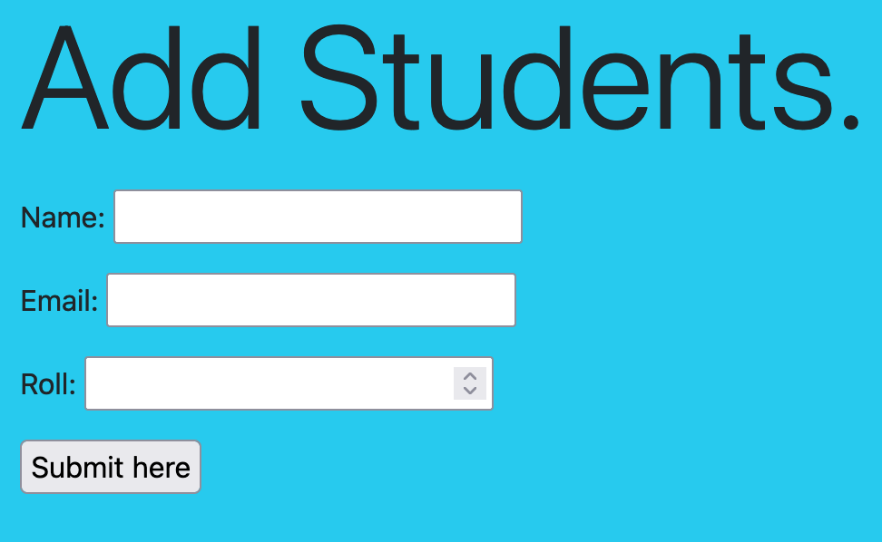
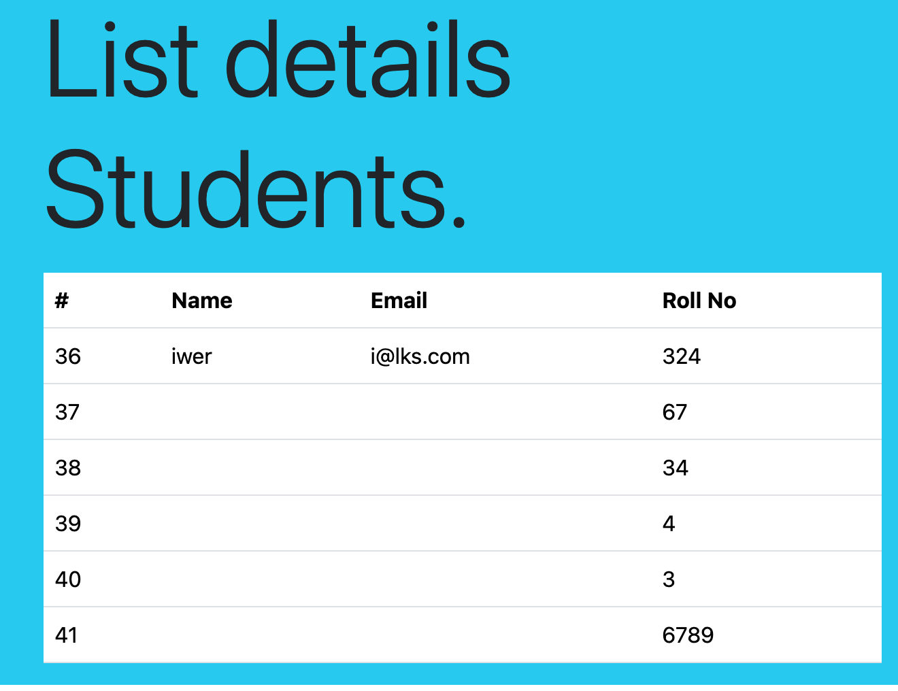

# This shows the add students details Here

## Now this wil be student id

## Documentation for heading 2

### Documentation for Heading 3

How are you doing here.How are you doing here.How are you doing here.How are you doing here.How are you doing here.How are you doing here.How are you doing here.How are you doing here.How are you doing here.

#### Heading FOur Part

How are you doing here.
lorem
lorem how you do
good to have you here

##### Heading Five Part

How are you doing here.
lorem
lorem how you do
good to have you here

###### Heading SIX Part

How are you doing here.
lorem
lorem how you do
good to have you here

*Italics Statement here* <br>
**BOld Statment here** <br>

***Bold and italics here*** <br>

*Images Here* <br>


**LInked Text**
[google](http://google.com)

***Images Alternate Text***


- Fruits
  - Mango
  - banana
- Pickle
  - Chilly
  - Papaya

1. Nepal
    1. Bagmati
    2. Pokohar
    3. Kathmandu
2. India
    1. Apple
    2. Banana

---

- Laptop
  - Apple
  - Windows
  - Lenevo
- Home
  - Banchauri
  - Badiya
  - Timkiya

1. Laptop
    1. windows
    2. leneov
    3. New
2. Home
    1. Nepal
    2. Bagmati

> This is life  
>> How to do this one <br>  
> This is new  
> Hero
>> jacktion
>> jackle
This is new
---
HOw are you  doing
> one
>> two
>>> three  
---

> Second
>> 2.2
>>> 2.3

```

class StudentForm(forms.ModelForm):
    class Meta:
        model = Student
        fields = "__all__"


```

hello this is the statement in the programming lanaguage here :
`print("ram " + 456 + "dkdll);`

- [x] Task 1
- [ ] Task 2
- [ ] Task 3

~~How are yousdf d~~

### To-Do List

- [x] Write a blog post
- [ ] Update the documentation
- [ ] Review pull requests
- [ ] Plan next sprint

Github
: is the code repo platforms

Bitbuck
: is the source code private

### Table data

|name|loc|salary|contract|
|----|---|----|-----|
|ram|ktm|343535|full-time|
|sti|jank|3423434|Part-time|
|----|---|----|-----|

### javascript code

```javascript
var button = document.getElementById('myButton');

// Add a click event listener to the button
button.addEventListener('click', function() {
    alert('Button clicked!');
});
```

### java code

```java
public class HelloWorld {
    public static void main(String[] args) {
        // Display "Hello, World!"
        System.out.println("Hello, World!");
        
        // Calculate the sum of 8 and 9
        int num1 = 8;
        int num2 = 9;
        int sum = num1 + num2;
        
        // Display the result
        System.out.println("The sum of " + num1 + " and " + num2 + " is " + sum);
    }
}```


```python
print("Hello, World!")

# Calculate the sum of 8 and 9
num1 = 8
num2 = 9
sum_result = num1 + num2

# Display the result
print("The sum of", num1, "and", num2, "is", sum_result)
```

## c program

```C
#include <stdio.h>

int main() {
    // Display "Hello, World!"
    printf("Hello, World!\n");

    // Calculate the sum of 8 and 9
    int num1 = 8;
    int num2 = 9;
    int sum = num1 + num2;

    // Display the result
    printf("The sum of %d and %d is %d\n", num1, num2, sum);

    return 0;
}
```

#### To do Task List

- [x] one
- [] two
- [] three
- [x] Four
